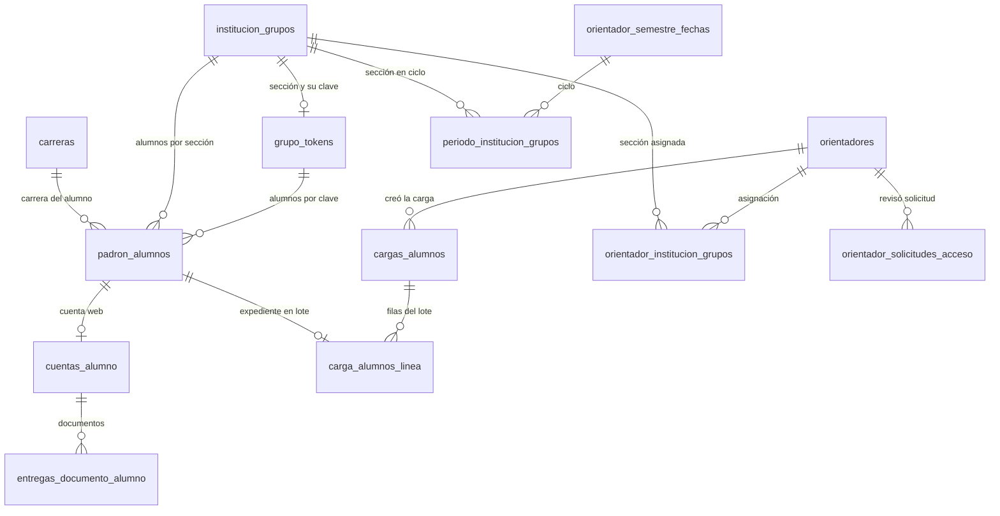
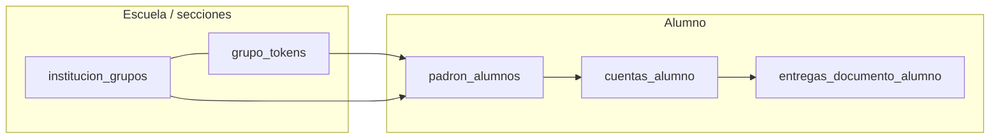
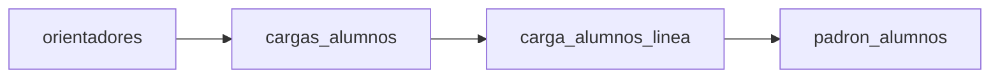

# Base de datos AIDA — diseño (apartado 11)

Este documento cubre lo que suele pedirse en **“Diseño de base de datos”**:

1. **Diagrama entidad–relación** (Mermaid).
2. **Descripción de cada entidad / tabla** (lenguaje claro, no técnico).
3. **Diccionario de datos** (cada campo: tipo en base de datos y qué significa).

El modelo evoluciona con migraciones; referencia principal: `supabase/` (p. ej. `aida_base_completa.sql`, `schema.sql`, `cargas_alumnos_extension.sql`, `periodos_y_semestre.sql`, `rls_politicas_por_rol.sql`).

---

## Diagrama (visión general)

El diagrama resume **relaciones principales**. Algunas tablas tienen reglas extra (por ejemplo, un alumno en padrón debe tener enlace por token **o** por sección del catálogo).

### Bloque “alumnos y documentos”

### Bloque “cargas e inscripción”

---

## Descripción por tabla

### `institucion_grupos`

**Qué es:** El catálogo de **secciones** de la escuela: cada fila es un grado (1.° a 6.°) más una letra de grupo (A, B, C…).

**Para qué sirve:** Ubicar a cada alumno en “qué salón / grupo escolar” pertenece, sin depender solo de la clave de acceso. Es la referencia estable cuando los alumnos avanzan de grado o cuando ya no usan token.

**Relación con otras tablas:** Los **tokens** de grupo pueden enlazarse a una sección concreta. El **padrón** apunta aquí cuando el expediente va anclado a la sección. Los **periodos / semestre** también relacionan secciones con el ciclo escolar.

---

### `grupo_tokens`

**Qué es:** Las **claves** que el orientador entrega (por grupo) para que el alumno entre la primera vez o mientras aplica esa modalidad.

**Para qué sirve:** Validar que solo quien está en la lista institucional puede crear cuenta. Tiene fecha límite de entrega cuando se configura: después de esa fecha el acceso con esa clave deja de valer.

**Relación con otras tablas:** Cada token puede estar ligado a una fila de **`institucion_grupos`**. El **padrón** históricamente salía del token; en instalaciones nuevas el alumno puede quedar más ligado a la **sección** que a la clave.

---

### `carreras`

**Qué es:** El listado de **carreras** que la escuela maneja (nombre y un código interno).

**Para qué sirve:** A partir de cierto grado (desde 2.° en adelante en el modelo AIDA), el alumno o el orientador asignan una carrera al expediente.

**Relación con otras tablas:** Cada expediente en **`padron_alumnos`** puede tener una carrera elegida (o ninguna si aún no aplica).

---

### `padron_alumnos`

**Qué es:** El **expediente institucional** de cada alumno: nombre, grado mostrado, carrera, matrícula, si está activo o en “archivo muerto”, y enlaces a la sección y/o al token.

**Para qué sirve:** Es la “ficha” que usa la escuela para saber quién es el alumno, en qué grupo está y si puede usar la app. Sin estar en esta lista (o sin reglas equivalentes), no hay cuenta válida.

**Relación con otras tablas:** Depende de **`grupo_tokens`** y/o **`institucion_grupos`**. Opcionalmente de **`carreras`**. De aquí nace **`cuentas_alumno`**. Las **líneas de carga** apuntan al mismo expediente para saber en qué lote de inscripción entró.

---

### `cuentas_alumno`

**Qué es:** La **contraseña** (guardada de forma segura) que el alumno definió para entrar al panel.

**Para qué sirve:** Autenticar al alumno en la web sin usar el login de Supabase para alumnos: una cuenta = un expediente.

**Relación con otras tablas:** Exactamente **un** registro por expediente en **`padron_alumnos`**. Las **entregas de documentos** pertenecen a esta cuenta.

---

### `entregas_documento_alumno`

**Qué es:** Cada **documento** que el alumno subió (o que el sistema registró), con su estado: pendiente de revisión, validado o rechazado, y dónde está el archivo.

**Para qué sirve:** Saber qué falta del trámite, qué ya revisó el orientador y conservar la pista del archivo en almacenamiento. Puede incluir datos extra de OCR si se usó.

**Relación con otras tablas:** Pertenece a **`cuentas_alumno`** (y por tanto al mismo alumno del padrón).

---

### `orientadores`

**Qué es:** Las **cuentas del personal** que usan el panel del orientador (correo, nombre, contraseña, si está activo y el tipo de rol en panel).

**Para qué sirve:** Entrar al panel para cargar alumnos, revisar expedientes, plantillas, etc. El rol puede limitar qué ven (por ejemplo, orientador normal vs. jefe).

**Relación con otras tablas:** Crean **`cargas_alumnos`**. Pueden tener **secciones asignadas** en **`orientador_institucion_grupos`**. Pueden aparecer como quien revisó **`orientador_solicitudes_acceso`**.

---

### `orientador_solicitudes_acceso`

**Qué es:** Personas que **pidieron** acceso al panel de orientador y están pendientes, aceptadas o rechazadas.

**Para qué sirve:** Flujo de altas controladas sin dar de alta orientadores a ciegas.

**Relación con otras tablas:** Opcionalmente enlaza con **`orientadores`** cuando alguien ya revisó la solicitud.

---

### `orientador_plantillas`

**Qué es:** Los **PDFs** del “muro” de plantillas y, si aplica, la definición de zonas para rellenar datos del alumno automáticamente.

**Para qué sirve:** Compartir formatos entre orientadores y generar documentos con datos del expediente.

**Relación con otras tablas:** No suele tener claves foráneas a alumnos; es catálogo de archivos de trabajo del orientador.

---

### `cargas_alumnos`

**Qué es:** Un **lote de inscripción**: fecha de cierre común, grado del proceso y letras de grupo incluidas (A, B…).

**Para qué sirve:** Agrupar el alta masiva de alumnos en una misma “encarga” y acotar acciones (por ejemplo, acciones masivas por grupo respecto a esa carga).

**Relación con otras tablas:** La crea un **`orientadores`**. Contiene muchas **`carga_alumnos_linea`**.

---

### `carga_alumnos_linea`

**Qué es:** Cada **alumno concreto** dentro de una carga: nombre, letra de grupo en ese lote y enlace al expediente del padrón.

**Para qué sirve:** Saber exactamente quién entró en qué encarga y con qué grupo letra, sin duplicar el expediente.

**Relación con otras tablas:** Pertenece a **`cargas_alumnos`** y apunta a **`padron_alumnos`**.

---

### `orientador_semestre_fechas`

**Qué es:** Las **fechas de referencia** del calendario escolar para cambios de semestre o procesos automáticos (normalmente una sola fila activa).

**Para qué sirve:** Marcar el ciclo en el que opera la escuela y, junto con otras pantallas, apoyar promoción o cortes de periodo.

**Relación con otras tablas:** Es el “periodo” al que se asocian filas de **`periodo_institucion_grupos`**.

---

### `periodos_academicos`

**Qué es:** Ventanas de fechas (**inicio / fin**) pensadas como periodos académicos.

**Para qué sirve:** En instalaciones antiguas o reportes; el flujo principal de semestre apunta más a **`orientador_semestre_fechas`**.

**Relación con otras tablas:** Tabla relativamente independiente respecto al resto del diagrama principal.

---

### `periodo_institucion_grupos`

**Qué es:** Tabla puente: qué **secciones** del catálogo participan en un **ciclo de semestre** concreto.

**Para qué sirve:** Saber, para ese ciclo, qué grupos (grado + letra) están dados de alta en el periodo.

**Relación con otras tablas:** Une **`orientador_semestre_fechas`** con **`institucion_grupos`**.

---

### `orientador_institucion_grupos`

**Qué es:** Tabla puente: qué **secciones** puede atender cada **orientador** (cuando se usa control fino por asignación).

**Para qué sirve:** Limitar qué expedientes o alumnos ve cada orientador si la política de seguridad lo exige.

**Relación con otras tablas:** Une **`orientadores`** con **`institucion_grupos`**.

---

### `logs`

**Qué es:** **Historial de acciones** relevantes: quién (orientador, sistema o alumno) hizo qué, sobre qué tipo de dato y cuándo.

**Para qué sirve:** Auditoría, trazabilidad y soporte cuando hay que revisar un cambio o un error.

**Relación con otras tablas:** No siempre hay clave foránea estricta; guarda identificadores en texto/JSON para flexibilidad. Algunos cambios en tablas sensibles también pueden registrarse por disparadores automáticos.

---

## Diccionario de datos

En las tablas, **tipo** es el tipo en PostgreSQL/Supabase. Las descripciones son funcionales (qué representa el dato en AIDA).

### `institucion_grupos`

| Campo | Tipo | Descripción |
|--------|------|-------------|
| `id` | uuid | Identificador único de la sección (grado + letra). |
| `grado` | smallint | Grado escolar de 1 a 6. |
| `grupo` | text | Letra o clave del grupo (A, B, C…). |
| `creado_en` | timestamptz | Cuándo se registró esta sección en el catálogo. |

---

### `grupo_tokens`

| Campo | Tipo | Descripción |
|--------|------|-------------|
| `id` | uuid | Identificador del token / clave de grupo. |
| `clave_acceso` | text | Clave que escribe el alumno para validarse (única en el sistema). |
| `grupo` | text | Letra de grupo asociada a la clave. |
| `grado` | text | Grado asociado a la clave (como texto, p. ej. "1"). |
| `creado_en` | timestamptz | Cuándo se creó el token. |
| `fecha_limite_entrega` | date | Último día en que la clave permite acceso; después queda inactiva. |
| `institucion_grupo_id` | uuid | Sección del catálogo enlazada (opcional; una clave por sección cuando existe). |

---

### `carreras`

| Campo | Tipo | Descripción |
|--------|------|-------------|
| `id` | uuid | Identificador de la carrera. |
| `codigo` | text | Código interno único (p. ej. para reportes o integraciones). |
| `nombre` | text | Nombre visible de la carrera (lo que ve usuario y orientador). |

---

### `padron_alumnos`

| Campo | Tipo | Descripción |
|--------|------|-------------|
| `id` | uuid | Identificador del expediente institucional del alumno. |
| `grupo_token_id` | uuid | Clave de grupo con la que se dio de alta (puede quedar vacío si ya no aplica). |
| `institucion_grupo_id` | uuid | Sección escolar actual del alumno en el catálogo (obligatorio si no hay token). |
| `nombre_completo` | text | Nombre del alumno como figura en la lista oficial. |
| `creado_en` | timestamptz | Alta del registro en padrón. |
| `grado_alumno` | text | Grado que muestra la app (1–6); si está vacío se deduce del token o la sección. |
| `carrera_id` | uuid | Carrera elegida; aplica desde 2.°; en 1.° suele ir vacío. |
| `matricula` | text | Matrícula o clave escolar; típico desde 2.° con carrera. |
| `archivo_muerto_en` | timestamptz | Si tiene fecha, el expediente está dado de baja (inactivo) hasta reactivar. |

*Restricción:* debe existir **token** y/o **sección** (`institucion_grupo_id`).

---

### `cuentas_alumno`

| Campo | Tipo | Descripción |
|--------|------|-------------|
| `id` | uuid | Identificador de la cuenta de acceso web. |
| `padron_id` | uuid | Expediente del alumno al que pertenece (uno a uno). |
| `password_hash` | text | Contraseña protegida (no se guarda la contraseña en claro). |
| `creado_en` | timestamptz | Cuándo creó contraseña el alumno. |
| `actualizado_en` | timestamptz | Último cambio de credenciales. |

---

### `entregas_documento_alumno`

| Campo | Tipo | Descripción |
|--------|------|-------------|
| `id` | uuid | Identificador de esta entrega concreta. |
| `cuenta_id` | uuid | Cuenta del alumno que subió el archivo. |
| `tipo_documento` | text | Tipo de trámite (constantes en la aplicación, p. ej. CURP, INE…). |
| `estado` | text | `validado`, `rechazado` o `pendiente_revision_manual`. |
| `motivo_rechazo` | text | Explicación si fue rechazado. |
| `ruta_storage` | text | Ubicación del archivo en almacenamiento. |
| `validacion_automatica` | boolean | Si hubo intento de validación automática. |
| `subido_en` | timestamptz | Momento de la subida. |
| `actualizado_en` | timestamptz | Última modificación del registro. |
| `etiqueta_personalizada` | text | Título legible para adjuntos especiales (p. ej. citatorios). |
| `ocr_campos` | jsonb | Resultado estructurado del OCR, si se extrajo texto del PDF/imagen. |
| `ocr_tramite` | text | Tipo de documento usado en el proceso OCR. |
| `ocr_extraido_en` | timestamptz | Cuándo se ejecutó la extracción OCR. |
| `ocr_error` | text | Mensaje corto si falló el OCR. |

*Una fila por cuenta y tipo de documento.*

---

### `orientadores`

| Campo | Tipo | Descripción |
|--------|------|-------------|
| `id` | uuid | Identificador del orientador. |
| `email` | text | Correo de acceso al panel (único). |
| `password_hash` | text | Contraseña protegida del orientador. |
| `nombre` | text | Nombre para mostrar. |
| `estado_acceso` | text | `activo` o `inactivo`; si está inactivo no puede iniciar sesión. |
| `rol_panel` | text | `normal` (panel habitual) o `jefe` (incluye historial global y solicitudes de acceso). |
| `creado_en` | timestamptz | Alta del orientador. |

---

### `orientador_solicitudes_acceso`

| Campo | Tipo | Descripción |
|--------|------|-------------|
| `id` | uuid | Identificador de la solicitud. |
| `email` | text | Correo del solicitante (único). |
| `password_hash` | text | Contraseña que quedará si se acepta la solicitud. |
| `estado` | text | `pendiente`, `aceptada` o `rechazada`. |
| `creado_en` | timestamptz | Cuándo envió la solicitud. |
| `revisado_en` | timestamptz | Cuándo un jefe la revisó. |
| `revisado_por_orientador_id` | uuid | Orientador que aceptó o rechazó (opcional). |

---

### `orientador_plantillas`

| Campo | Tipo | Descripción |
|--------|------|-------------|
| `id` | uuid | Identificador de la plantilla. |
| `titulo` | text | Título visible en el muro de plantillas. |
| `nombre_archivo` | text | Nombre del archivo original. |
| `ruta_storage` | text | Ubicación del PDF en almacenamiento (única). |
| `creado_en` | timestamptz | Cuándo se subió. |
| `definicion_relleno` | jsonb | Coordenadas y campos para rellenar el PDF con datos del alumno. |

---

### `cargas_alumnos`

| Campo | Tipo | Descripción |
|--------|------|-------------|
| `id` | uuid | Identificador del lote / encarga. |
| `orientador_id` | uuid | Orientador que creó la carga. |
| `fecha_cierre` | date | Fecha de cierre común de acceso para esa inscripción. |
| `grado_carga` | smallint | Grado del proceso de carga (1–6). |
| `grupos_letras` | text[] | Letras de grupo incluidas en el lote (A, B…). |
| `creado_en` | timestamptz | Cuándo se registró la carga. |

---

### `carga_alumnos_linea`

| Campo | Tipo | Descripción |
|--------|------|-------------|
| `id` | uuid | Identificador de la fila dentro del lote. |
| `carga_id` | uuid | Carga a la que pertenece. |
| `grupo_letra` | text | Letra de grupo asignada en esa encarga. |
| `nombre_completo` | text | Nombre del alumno en ese lote. |
| `padron_id` | uuid | Expediente en padrón vinculado (único: un alumno no se repite en otra línea). |

---

### `orientador_semestre_fechas`

| Campo | Tipo | Descripción |
|--------|------|-------------|
| `id` | uuid | Identificador del registro de calendario (suele usarse una fila). |
| `primer_periodo_fecha` | date | Primera fecha de referencia del ciclo (p. ej. cambio de semestre). |
| `segundo_periodo_fecha` | date | Segunda fecha de referencia del ciclo. |
| `nombre_anios` | text | Etiqueta legible del ciclo (p. ej. rango de años). |
| `actualizado_en` | timestamptz | Última modificación de estas fechas. |
| `promocion_primer_ejecutada_en` | timestamptz | Marca si ya se aplicó promoción automática para la primera fecha. |
| `promocion_segundo_ejecutada_en` | timestamptz | Igual para la segunda fecha. |

---

### `periodos_academicos`

| Campo | Tipo | Descripción |
|--------|------|-------------|
| `id` | uuid | Identificador del periodo. |
| `fecha_inicio` | date | Inicio de la ventana. |
| `fecha_fin` | date | Fin de la ventana (debe ser ≥ inicio). |
| `creado_en` | timestamptz | Alta del registro. |

*Uso mayormente legado; el flujo principal de semestre usa `orientador_semestre_fechas`.*

---

### `periodo_institucion_grupos`

| Campo | Tipo | Descripción |
|--------|------|-------------|
| `periodo_id` | uuid | Ciclo de semestre (`orientador_semestre_fechas.id`). |
| `institucion_grupo_id` | uuid | Sección del catálogo incluida en ese ciclo. |
| `asignado_en` | timestamptz | Cuándo se hizo el vínculo. |

*Clave primaria compuesta: (`periodo_id`, `institucion_grupo_id`).*

---

### `orientador_institucion_grupos`

| Campo | Tipo | Descripción |
|--------|------|-------------|
| `orientador_id` | uuid | Orientador. |
| `institucion_grupo_id` | uuid | Sección que puede atender. |
| `creado_en` | timestamptz | Cuándo se asignó. |

*Clave primaria compuesta: (`orientador_id`, `institucion_grupo_id`).*

---

### `logs`

| Campo | Tipo | Descripción |
|--------|------|-------------|
| `id` | uuid | Identificador del evento de auditoría. |
| `creado_en` | timestamptz | Momento del registro. |
| `actor_tipo` | text | Quién actuó: `orientador`, `sistema` o `alumno`. |
| `actor_id` | uuid | Identificador del actor cuando aplica (puede ir vacío). |
| `actor_etiqueta` | text | Texto legible del actor (correo, “sistema”, etc.). |
| `accion` | text | Qué ocurrió, en lenguaje descriptivo o código de acción. |
| `entidad` | text | Sobre qué tabla o tipo de dato (p. ej. `padron_alumnos`). |
| `entidad_id` | text | Identificador del registro afectado, en texto. |
| `detalle` | jsonb | Información extra (antes/después, contadores, etc.). |
| `origen` | text | `api` (acción desde la aplicación) o `trigger` (registro automático en base de datos). |

---

## Nota final

- Las **funciones** y **disparadores** en SQL (por ejemplo archivar o reactivar expedientes, registrar log) automatizan reglas de negocio; no son “tablas”, pero escriben en **`padron_alumnos`** y **`logs`**.
- Si el entorno usa **solo la API con rol de servicio**, muchas políticas de visibilidad (RLS) no se notan en el día a día; igual conviene conocer el modelo para entender la app.

*Última revisión alineada con el repositorio AIDA (esquema Supabase + extensiones de cargas, periodos y padrón por sección).*
